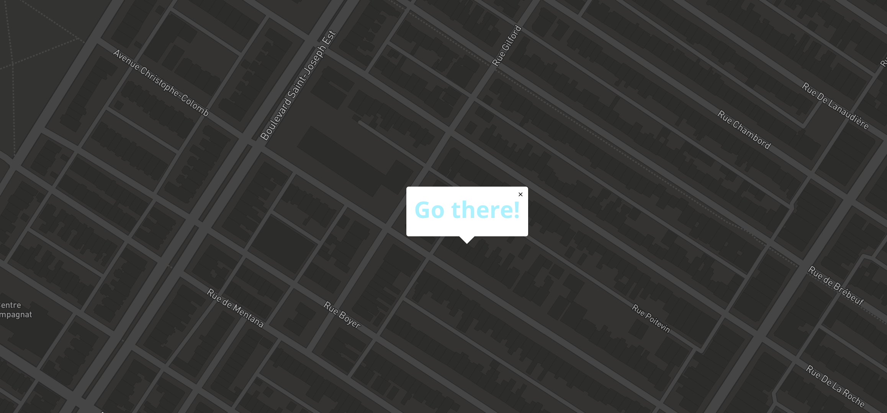

# Mapmarker

Mapmarker is a simple map project to display a circle marker at the center of a map, using URL hash to give GPS coordinates. It uses [MapboxGL](https://www.mapbox.com/maps/) to render maps using WebGL. Cool to use in *iframes*. I also used it in [another project](https://github.com/jonathanlurie/twentytwenty) to display maps along with geotagged pictures.  

Mapmarker comes with several kind of maps **DEMOS**:
- [bright.html](http://jonathanlurie.github.io/Mapmarker/bright.html#12.87/45.5020/-73.5703)
- [dark.html](http://jonathanlurie.github.io/Mapmarker/dark.html#12.87/45.5020/-73.5703)
- [light.html](http://jonathanlurie.github.io/Mapmarker/light.html#12.87/45.5020/-73.5703)
- [satellite.html](http://jonathanlurie.github.io/Mapmarker/satellite.html#12.87/45.5020/-73.5703)
- [hybrid.html](http://jonathanlurie.github.io/Mapmarker/hybrid.html#12.87/45.5020/-73.5703)
- [outdoors.html](http://jonathanlurie.github.io/Mapmarker/outdoors.html#12.87/45.5020/-73.5703)
- [streets.html](http://jonathanlurie.github.io/Mapmarker/streets.html#12.87/45.5020/-73.5703)

For each style, you can customize the URL to mark a specific location:  
```
http://jonathanlurie.github.io/Mapmarker/streets.html#14/47.9421/-70.4758
```

## The hash
The Hash is composed of 3 elements:
- zoom level, from 0 to 20, decimal allowed
- the latitude, from -85 to 85
- the longitude, from -180 to 180

The hash updates itself when the map is panned and zoomed. Then, if you reload, the marker will be again at the center.

## Move the marker
In addition to moving the map and refresh the page to place the marker at the hash position, you can also use a right click to open a "Go there" popup. When you "go there", the hash is updating accordingly and the marker is centered, but be careful, if you pan the map again, the hash will still be updated and will no longer match the marker position.



## License
MIT
